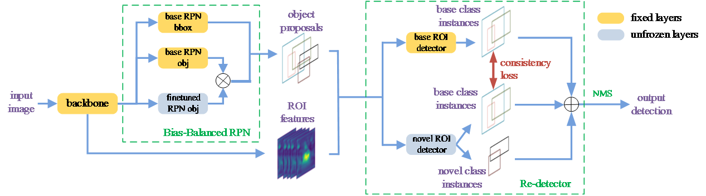

# Generalized Few-Shot Object Detection without Forgetting


This project provides an implementation for "[Generalized Few-Shot Object Detection without Forgetting](https://arxiv.org/pdf/2105.09491.pdf)" (CVPR2021) on PyTorch.

Experiments in the paper were conducted on the internal framework, thus we reimplement them on [cvpods](https://github.com/Megvii-BaseDetection/cvpods) and report details as below.



## Requirements
* [cvpods](https://github.com/Megvii-BaseDetection/cvpods)

## Get Started

* install cvpods locally (requires cuda to compile)
```shell

python3 -m pip install 'git+https://github.com/Megvii-BaseDetection/cvpods.git'
# (add --user if you don't have permission)

# Or, to install it from a local clone:
git clone https://github.com/Megvii-BaseDetection/cvpods.git
python3 -m pip install -e cvpods

# Or,
pip install -r requirements.txt
python3 setup.py build develop
```

* prepare datasets
```shell
cd /path/to/cvpods
cd datasets
ln -s /path/to/your/coco/dataset coco
ln -s /path/to/your/voc/dataset voc
```

* prepare datasets of few-shot detection benchmarks as "[FSDET_DATASET.md](FSDET_DATASET.md)"

* prepare pretrained weights
```shell
# download the pretrained faster r-cnn of TFA
# at http://dl.yf.io/fs-det/models/
# or train the weights yourself

# modify the weights' path in register_pretrained_weights.sh then
bash register_pretrained_weights.sh
```

* Train & Test (default w/ 8 GPUs)
```shell
cd /path/to/experiment
bash run.sh
```

## Results on COCO few-shot detection benchmarks
| experiment | AP | bAP | nAP |
|:------|:---:|:---:|:---:|
| [5shot](./playground/fsdet/coco/retentive_rcnn/5shot/seed0/) | 31.5 | 39.2 | 8.3 |
| [10shot](./playground/fsdet/coco/retentive_rcnn/10shot/seed0/) | 32.1 | 39.2 | 10.5 |
| [30shot](./playground/fsdet/coco/retentive_rcnn/30shot/seed0/) | 32.9 | 39.3 | 13.8 |

## Results on VOC few-shot detection benchmarks
| experiment | AP50 | bAP50 | nAP50 |
|:------|:---:|:---:|:---:|
| [split1-1shot](./playground/fsdet/voc/split1/retentive_rcnn/1shot/) | 71.3 | 80.9 | 42.4 |
| [split1-2shot](./playground/fsdet/voc/split1/retentive_rcnn/2shot/) | 72.3 | 81.1 | 45.8 |
| [split1-3shot](./playground/fsdet/voc/split1/retentive_rcnn/3shot/) | 72.1 | 80.8 | 45.9 |
| [split1-5shot](./playground/fsdet/voc/split1/retentive_rcnn/5shot/) | 74.0 | 80.8 | 53.7 |
| [split1-10shot](./playground/fsdet/voc/split1/retentive_rcnn/10shot/) | 74.6 | 80.8 | 56.1 |
| [split2-1shot](./playground/fsdet/voc/split2/retentive_rcnn/1shot/) | 66.8 | 81.8 | 21.7 |
| [split2-2shot](./playground/fsdet/voc/split2/retentive_rcnn/2shot/) | 68.4 | 81.9 | 27.8 |
| [split2-3shot](./playground/fsdet/voc/split2/retentive_rcnn/3shot/) | 70.2 | 81.9 | 35.2 |
| [split2-5shot](./playground/fsdet/voc/split2/retentive_rcnn/5shot/) | 70.7 | 81.9 | 37.0 |
| [split2-10shot](./playground/fsdet/voc/split2/retentive_rcnn/10shot/) | 71.5 | 81.9 | 40.3 |
| [split3-1shot](./playground/fsdet/voc/split3/retentive_rcnn/1shot/) | 69.0 | 81.9 | 30.2 |
| [split3-2shot](./playground/fsdet/voc/split3/retentive_rcnn/2shot/) | 70.9 | 82.0 | 37.6 |
| [split3-3shot](./playground/fsdet/voc/split3/retentive_rcnn/3shot/) | 72.3 | 82.1 | 43.0 |
| [split3-5shot](./playground/fsdet/voc/split3/retentive_rcnn/5shot/) | 73.9 | 82.0 | 49.7 |
| [split3-10shot](./playground/fsdet/voc/split3/retentive_rcnn/10shot/) | 74.1 | 82.1 | 50.1 |

## Acknowledgement
This repo is developed based on cvpods. Please check [cvpods](https://github.com/Megvii-BaseDetection/cvpods) for more details and features.

## License
This repo is released under the Apache 2.0 license. Please see the LICENSE file for more information.

## Citing
If you use this work in your research or wish to refer to the results published here, please use the following BibTeX entries:
```
@article{fan2021generalized,
  title     =  {Generalized Few-Shot Object Detection without Forgetting},
  author    =  {Fan, Zhibo and Ma, Yuchen and Li, Zeming and Sun, Jian},
  booktitle =  {IEEE Conference on Computer Vision and Pattern Recognition},
  year      =  {2021}
}
```

## Contributing to the project
Any pull requests or issues about the implementation are welcome. If you have any issue about the library (e.g. installation, environments), please refer to [cvpods](https://github.com/Megvii-BaseDetection/cvpods).
